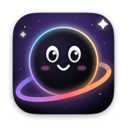
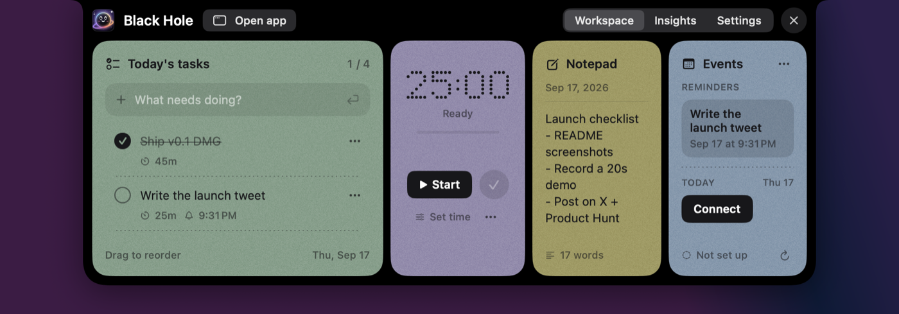
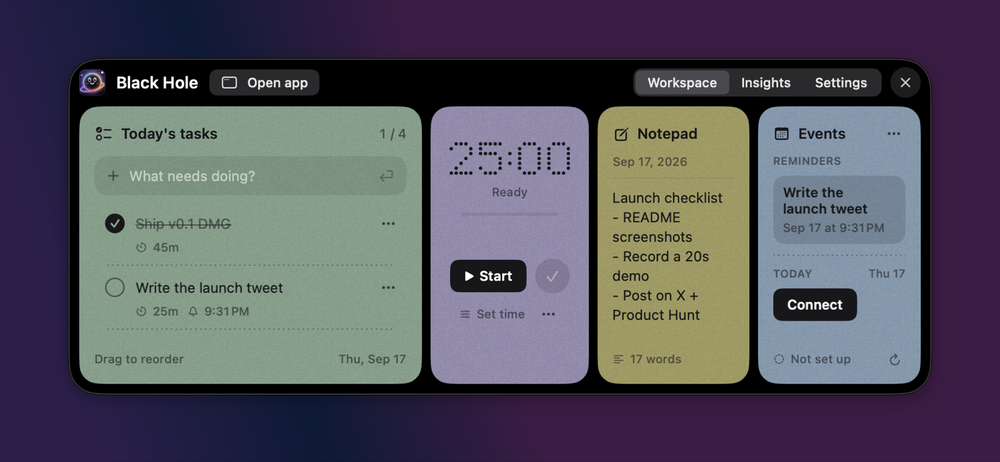
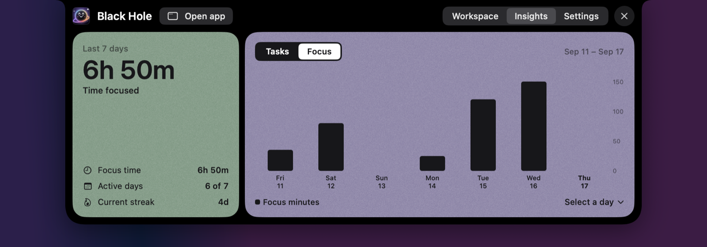
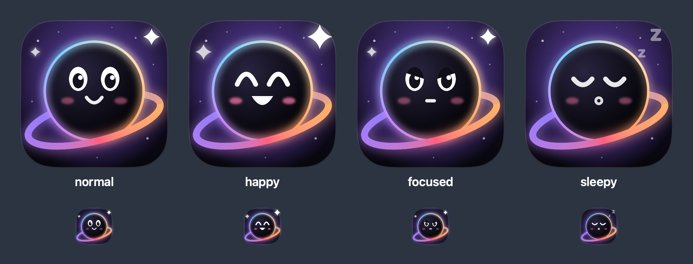

<p align="center">
  
</p>

<h1 align="center">Black Hole</h1>

<p align="center">
  <b>Your whole day, one hover away.</b><br>
  Tasks, a focus timer, a daily notepad and today's calendar, living in your Mac's notch.
</p>

<p align="center">
  <a href="https://github.com/vanshpatelx/blackhole/releases/latest"><b>Download for Mac</b></a> ·
  <a href="https://getblackhole.app"><b>getblackhole.app</b></a> ·
  <a href="docs/ROADMAP.md">Roadmap</a>
</p>

<p align="center">
  
</p>

## Why

Your to-do app is in another window, your timer is in another app, and your notes are somewhere else. Black Hole puts all of it at the top of your screen. Hover the notch (or press <kbd>⌥</kbd><kbd>N</kbd>), do the thing, and get back to work.

It's free, open source, and your data never leaves your Mac.

## Features

- **Today's tasks**: add, check off, drag to reorder, set time limits and reminders, move to tomorrow. Unfinished tasks roll over to the next day on their own.
- **Focus timer**: countdown or stopwatch with pause, resume and +5 minutes. While it runs, the notch becomes a live island: a progress ring on one side and the countdown on the other. It pauses when your Mac sleeps.
- **Daily notepad**: saves as you type. Put the cursor on a line and press <kbd>⌘</kbd><kbd>↩</kbd> to turn it into a task.
- **Events from all your calendars**: iCloud, Google (as many accounts as you like), Outlook/Exchange and subscribed calendars, color-coded and read-only. Pick which calendars show in **Settings → Calendars**.
- **Repeating tasks**: daily, every weekday or weekly, from the task's menu or by typing "standup every weekday". The next occurrence appears on its own; a missed one is left where it was rather than following you around.
- **Quick capture**: press **⌥Space** anywhere and an input drops out of the notch. Type "call mika tomorrow at 3pm", press Return, and it's a task for tomorrow with a reminder — the day and time are lifted out of the sentence. Escape puts it away.
- **Your next meeting, in the notch**: five minutes before it starts the notch counts down to it, and clicking joins the call — Zoom, Meet, Teams, Webex and the rest, wherever the invite hid the link. Right-click to dismiss one.
- **Insights**: focus time, completed vs. planned tasks, active days and your streak over the last week.
- **Floating button**: a draggable button for any display (great with external monitors). Click it and the whole workspace opens right next to it.
- **Works with AI assistants (MCP)**: one URL connects Claude, Cursor, ChatGPT or any MCP client so they can list and add tasks, run focus sessions, read your notes and pull insights.
- **Holey the mascot**: blinks, looks up when you hover, cheers when you finish something, gets serious during focus sessions, and dozes off when you've been away.

<p align="center">
  
  
</p>

<p align="center">
  
</p>

## Install

1. Download the latest `BlackHole-x.y.z.dmg` from [Releases](https://github.com/vanshpatelx/blackhole/releases/latest).
2. Open it and drag **Black Hole** into **Applications**.
3. Open Black Hole. Current builds aren't notarized by Apple yet, so macOS will block the first launch:
   - Open **System Settings → Privacy & Security**, scroll down and click **Open Anyway** next to Black Hole, **or**
   - run `xattr -dr com.apple.quarantine "/Applications/Black Hole.app"` in Terminal.

**Requirements:** macOS 14 Sonoma or later on Apple silicon. No notch? It still works: the workspace opens from the top center of your screen, or from the floating button. Intel Macs can [build from source](#build-from-source) after changing `ARCHS` in `project.yml`.

## How to use

| Action | How |
|---|---|
| Open the workspace | Hover the notch, press <kbd>⌥</kbd><kbd>N</kbd>, or click the floating button |
| Close it | <kbd>Esc</kbd>, click outside, or move the pointer away |
| Note line → task | <kbd>⌘</kbd><kbd>↩</kbd> in the notepad |
| Task actions | Right-click a task, or use its **⋯** menu |
| Move the floating button | Drag it; it snaps to the nearest screen edge. Right-click it for more |
| Full window | **Open app** in the top bar |

## Google and Outlook calendars

Black Hole reads calendars through macOS, so add your accounts there once:

1. **System Settings → Internet Accounts → Add Account → Google** (repeat for each Google account; Microsoft Exchange/Outlook works the same way).
2. Make sure **Calendars** is switched on for the account.
3. In Black Hole, open **Settings → Calendars** and tick the calendars you want to see.

## Use it from AI apps (MCP)

Black Hole has a built-in [Model Context Protocol](https://modelcontextprotocol.io) server, so AI assistants can work with your day:

> *"Add my three most urgent GitHub issues to today"*
> *"Start a 45-minute focus session on the launch post"*
> *"What did I focus on this week?"*

1. Open **Settings → AI Assistants** and turn on **AI access (MCP)**. The first time, Black Hole sets up a secure web address for your Mac (it downloads a small tunnel client itself, about 20MB; no Homebrew or Terminal).
2. Click **Copy URL**.
3. Paste it into your assistant:
   - **claude.ai** → Settings → Connectors → Add custom connector, no authentication
   - **ChatGPT** → connectors in developer mode, no authentication
   - **Claude Code** → `claude mcp add --transport http black-hole <copied-url>`
   - **Cursor / Claude Desktop** → add an MCP server with that URL

The same URL works everywhere, so there's nothing else to configure.

### Good to know

- The URL carries your access token, so treat it like a password. **Reset Access Token** in the Copy menu revokes it immediately.
- Because the token sits in the URL path, it is visible to whoever operates the edge your requests cross — for the built-in address, the `getblackhole.app` Cloudflare zone — and to the assistant you paste it into. Your tasks and notes never pass through a Black Hole server, but the credential does cross that edge. With [Tailscale](https://tailscale.com) installed the tunnel stays inside your own tailnet instead, which avoids this entirely.
- It only answers while Black Hole is open, and your data stays on your Mac; the tunnel just forwards requests.
- The address is permanent: Black Hole registers one for your Mac the first time you turn AI access on, and reuses it afterwards. (With [Tailscale](https://tailscale.com) installed it uses Tailscale Funnel instead, which is also permanent.)
- Current URLs are also written to `~/Library/Application Support/Black Hole/mcp.json`, handy for scripts.

| Tool | What it does |
|---|---|
| `list_tasks`, `add_task`, `update_task`, `delete_task` | Manage tasks for any day, including repeats |
| `start_focus`, `pause_focus`, `resume_focus`, `stop_focus`, `focus_status` | Control the focus timer |
| `read_note`, `append_note` | Read and add to the daily notepad (never overwrites) |
| `get_insights` | Planned/completed tasks and focus minutes per day, plus streak |
| `todays_events` | Today's events from the calendars you chose to show |

## Privacy

Everything is stored locally in `~/Library/Application Support/Black Hole/`. There are no accounts, analytics or outgoing network calls. The optional MCP server only accepts connections from this Mac, unless you turn on **Remote access**, which opens a token-protected Cloudflare tunnel until you turn it off. Calendar access is optional and read-only: Black Hole never creates, edits or deletes events. You can export everything as JSON from **Settings → Data**.

## Build from source

```bash
brew install xcodegen
git clone https://github.com/vanshpatelx/blackhole.git
cd blackhole
make run      # generate the Xcode project, build and launch
```

| Command | What it does |
|---|---|
| `make project` | Generate `BlackHole.xcodeproj` from `project.yml` (then open it in Xcode if you like) |
| `make run` | Debug build and launch |
| `make demo` | Launch with sample data in memory; your real data is untouched |
| `make test` | Run the unit tests |
| `make dmg` | Build a Release DMG into `dist/` |
| `make setup` | Install the dev tools (XcodeGen, SwiftLint, SwiftFormat) and the pre-commit hook |
| `make lint` / `make format` | Check or apply formatting and lint rules |

Needs Xcode 16 or later. The Xcode project is generated and not committed, so edit `project.yml` for target settings.

### Repository layout

This repo holds everything: the app, the service that hands out addresses, and the website.

```
BlackHole/           The macOS app
server/              Cloudflare Worker that issues a permanent address per install
web/                 The getblackhole.app landing page (static, deployed to Cloudflare)
docs/                Roadmap and design notes
```

Each part deploys on its own: `make dmg` for the app, `wrangler deploy` inside `server/` or `web/`.

### App layout

```
BlackHole/
├─ App/              App entry, shared services (database, timer, calendar, mascot mood)
├─ Notch/            Notch panel window, hover + hotkey handling, notch shape, top bar
├─ FloatingButton/   Draggable floating button and the workspace that opens beside it
├─ MCP/              MCP server (JSON-RPC over HTTP), tunnels and its tools
├─ Features/         Tasks, Focus timer, Notepad, Events, Insights, Settings, Dashboard
├─ Data/             SwiftData models, JSON export, demo data
├─ DesignSystem/     Colors, cards, buttons, dot-matrix digits, Holey the mascot
└─ Resources/        App icon
```

## Roadmap

Next up: **multi-device sync** you control (your own Supabase or self-hosted server). See [docs/ROADMAP.md](docs/ROADMAP.md) and the [sync + MCP design](docs/SYNC_AND_MCP.md).

## Contributing

Issues and pull requests are welcome. Start with [CONTRIBUTING.md](CONTRIBUTING.md).

## License

[MIT](LICENSE)
